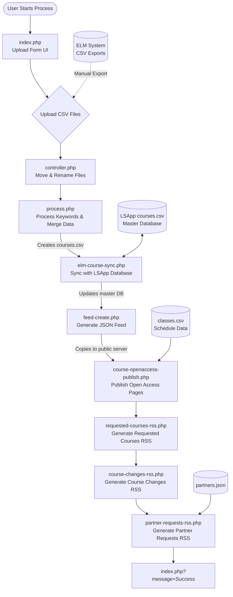
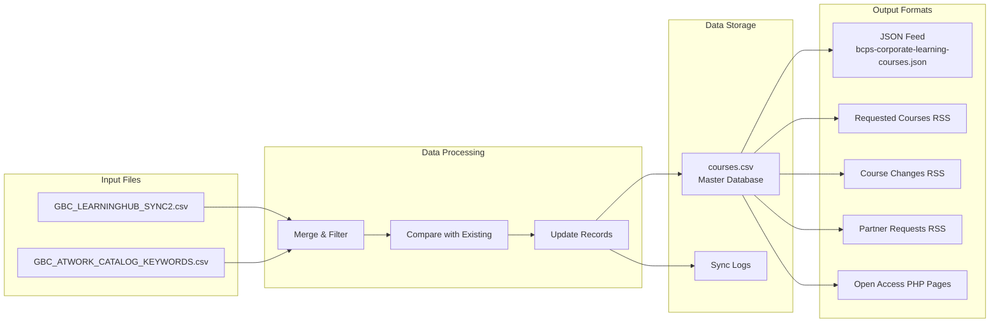
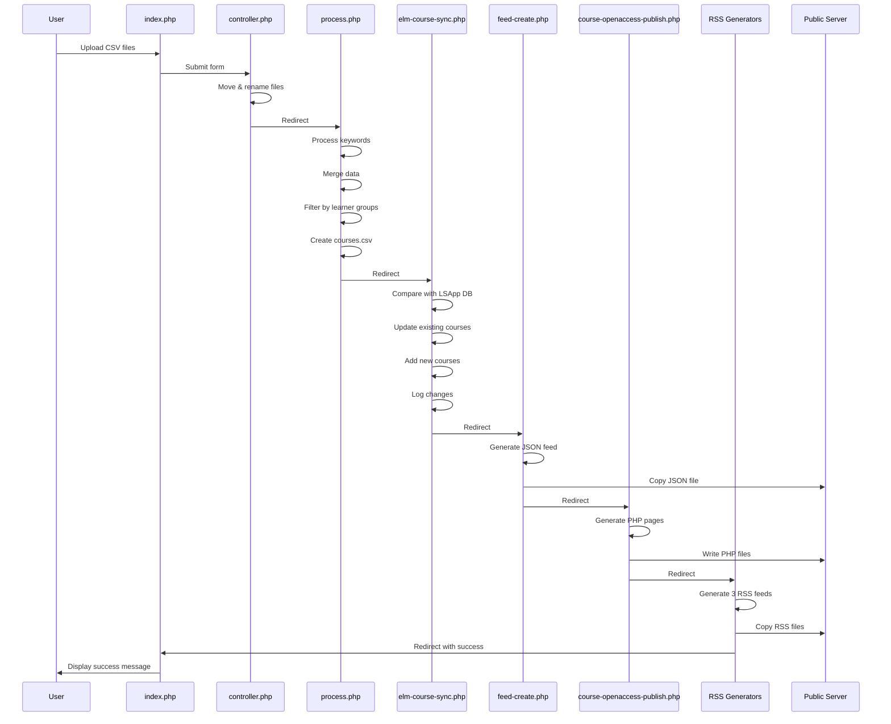
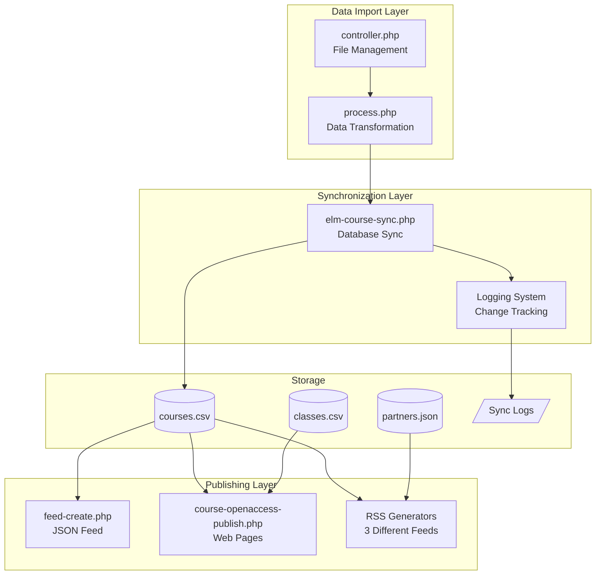
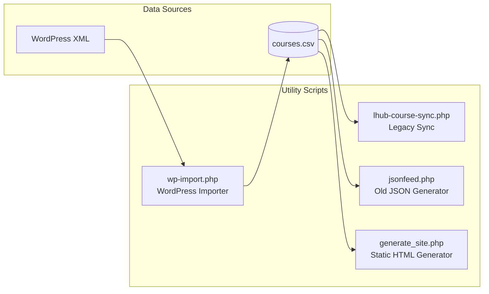
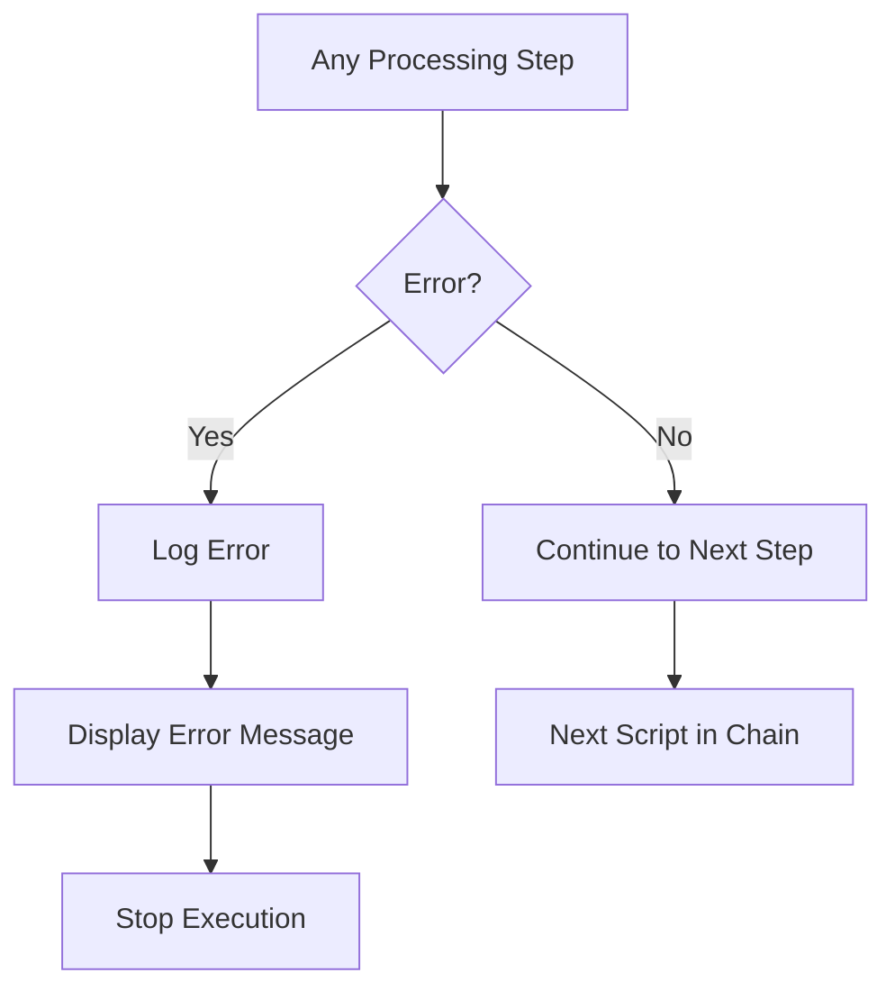

# Course Feed System - Execution Flow

## Overview
This document visualizes the execution flow of the course-feed system, which synchronizes courses from BC Government's ELM system with the LearningHUB platform.

## Main Process Flow

## Data Flow Detail

## File Processing Chain

## Key Components and Their Responsibilities

## Alternative/Utility Scripts

## Error Handling Flow

## Notes

- **Manual Process**: The entire flow is triggered manually through web interface
- **Sequential Execution**: Each script redirects to the next using HTTP headers
- **No Cron Jobs**: No automated scheduling found
- **Logging**: Comprehensive logging at each stage, especially during sync
- **Public Server**: Files are copied to `E:/WebSites/NonSSOLearning/` for public access
- **Access Control**: Open access pages include access code verification
- **Data Persistence**: HUBInclude and HUBPersist flags manage course visibility